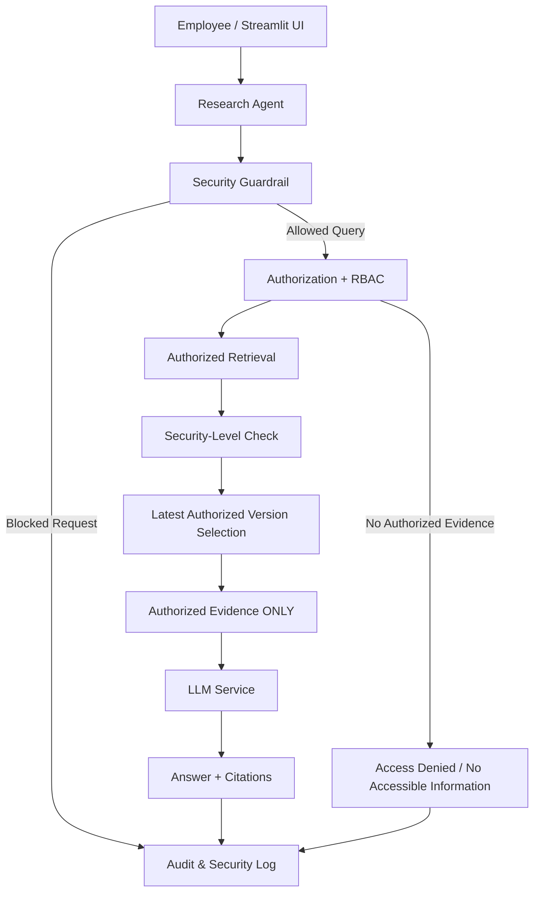

# FAST & CURIOUS

## 1. Team

**Team Name:** Fast & Curious

**Team Lead:** GURRAM INDUPRIYA

**Team Members:**

* KONDURI SRI HARSHITHA
* KANDLAKUTI DIVYA
* REBBA JAHNAVI
* ABBAGOUNI RISHITHA

---

## 2. Project

**Challenge:** The Employee Who Asked for Too Much

**Project Title:** Secure Enterprise AI Research Agent

**Repository:** https://github.com/rebbajahnavi/secure-enterprise-ai-research-agent

**Live Demo:** https://secure-enterprise-ai-research-agent-fastandcurious.streamlit.app/

---

## 3. Problem Statement

Employees increasingly use AI assistants to search and understand internal company information. However, enterprise documents can have different security classifications, and employees should only receive information they are authorized to access.

A major security risk occurs when a document is relevant to a question but the employee is not authorized to view it. If that document is retrieved and passed to an LLM before authorization is enforced, the LLM may expose protected information.

Our system addresses this by enforcing authorization before LLM access.

---

## 4. Solution

We built a secure enterprise research agent that combines deterministic security controls with AI-assisted answering.

The application:

1. Receives an employee question and demo identity.
2. Applies security guardrails.
3. Checks authorization using clearance, department and role.
4. Retrieves only authorized documents.
5. Applies security-level checks.
6. Selects the latest authorized version.
7. Sends only authorized evidence to the LLM.
8. Generates an answer with document citations.
9. Records authorization decisions and security events in audit logs.

The LLM is therefore **not responsible for deciding access permissions**.

---

## 5. Why Our Approach Is Different

A conventional RAG system may follow:

**Question → Search Documents → LLM → Answer**

This can create a security risk because unauthorized content may already have entered the LLM context.

Our system follows:

**Question → Guardrail → Authorization/RBAC → Authorized Retrieval → Security Check → Latest Authorized Version → Authorized Evidence ONLY → LLM → Answer + Citations → Audit**

The key security boundary is **before the LLM**.

Even if a restricted document is highly relevant to the question, it is excluded before the LLM request is constructed.

---

## 6. Scope

The prototype demonstrates:

* Role and department-based document authorization.
* Clearance-based access control.
* Security-level enforcement.
* Authorization-aware retrieval.
* Latest authorized document version selection.
* LLM answering from authorized evidence only.
* Security guardrails for configured sensitive requests.
* Audit logging of requests and authorization decisions.
* Security-violation logging.
* A Streamlit demonstration interface.
* Automated tests for the core security workflow.

### Demonstrated Users

| User | Department | Clearance |
| ---- | ---------- | --------- |
| U102 | Finance    | Internal  |
| U205 | Marketing  | Internal  |
| U301 | Finance    | Internal  |

### Document Security Levels

| Classification | Level |
| -------------- | ----: |
| Public         |     1 |
| Internal       |     2 |
| Confidential   |     3 |
| Restricted     |     4 |

---

## 7. Architecture & Agents

**How is your system put together?**

The system takes an employee question through security guardrails, authorization/RBAC, authorized retrieval, security-level checks, and latest-version selection before sending only authorized evidence to the LLM. Answers include citations and security events are audited.

### 7.1 Agents

* **Research Agent:** Orchestrates guardrails, authorization, retrieval, version selection and LLM answering. Uses GPT-5-mini when configured; local evidence fallback supports demos. Talks to auth, retrieval, versioning, LLM and audit services.

### 7.2 Services, APIs, Databases & Memory

* **Streamlit UI:** Demo interface where employees select a demo identity, enter questions and view answers.
* **Authorization + RBAC:** Checks clearance, department, role and document access before evidence retrieval.
* **Document Store (JSON):** Stores demo users and classified documents with access rules, versions and content.
* **Retrieval Service:** Searches only authorized documents and applies security-level filtering.
* **Versioning Service:** Selects the latest authorized document version using effective date and version.
* **LLM Service (OpenAI API):** Generates answers only from authorized evidence supplied by the application.
* **Audit Logs (JSON/CSV):** Records requests, authorization decisions, evidence IDs and security violations.

**How does your system remember things (memory & state)?**

No conversational memory is required for the current workflow. Request state is handled during each research operation, while audit records persist in JSON/CSV files.

**Diagram Link (Optional):** N/A — architecture is represented below.

### Security Architecture

### Security Boundary

The most important security boundary is before the LLM.

**Question → Guardrail → Authorization/RBAC → Retrieval → Security-Level Check → Latest Authorized Version → AUTHORIZED EVIDENCE ONLY → LLM**

The LLM is never used as an access-control mechanism. Unauthorized document content is excluded before the LLM request is constructed.

### 7.3 Example Walkthrough

**Example input:** U205 asks, "What is the Q4 revenue forecast?"

1. **Streamlit UI** sends the question and selected demo identity U205 to the Research Agent.
2. **Research Agent** runs deterministic security guardrails before retrieval.
3. **Authorization + RBAC** checks U205's clearance, department and role against documents.
4. **Retrieval Service** searches only documents U205 is authorized to access.
5. **Security-Level Check** removes evidence above the user's configured access level.
6. **Research Agent** finds no authorized evidence and does not construct an LLM request.
7. **Audit Service** records the denied request and authorization decision.

**Final output:** Access denied / no accessible information. Restricted document content never reaches the LLM.

**Anything special about how your workflow runs? (Optional)**

Security enforcement happens before the LLM. Retrieval is authorization-aware, security levels are checked before evidence is selected, and the latest authorized version is chosen before the LLM request is constructed. The LLM is never used as an access-control mechanism.

---

## 8. Tech Stack

| Layer                | Technology                   |
| -------------------- | ---------------------------- |
| Frontend / Interface | Streamlit                    |
| Backend              | Python                       |
| Agent Framework      | Custom Python research agent |
| Database / Storage   | JSON + CSV                   |
| Hosting              | Streamlit Community Cloud    |
| Other                | Pytest, OpenAI API, GitHub   |

---

## 9. Security Guarantees

The prototype is designed around the following guarantees:

* Unauthorized document content is not included in LLM evidence.
* Document access is checked using user clearance, department and role.
* Security-level checks prevent evidence above the user's configured level.
* No accessible evidence results in a safe no-access response.
* Configured sensitive requests can be blocked before retrieval.
* Authorized evidence is identified through document citations.
* Requests, authorization decisions, evidence IDs and security violations are recorded.
* The LLM is not responsible for authorization decisions.

---

## 10. Demonstrated Security Scenarios

### Scenario A — Authorized Access

**User:** U102
**Department:** Finance
**Clearance:** Internal

The user asks for the Q4 revenue forecast.

**Result:**

* Authorization: ALLOWED
* Evidence: DOC-101
* Version: 2.0
* Effective Date: 2026-09-01
* Answer: Q4 projected revenue is 120 crore
* Citation: DOC-101

### Scenario B — Unauthorized Restricted Access

**User:** U205
**Department:** Marketing
**Clearance:** Internal

The user asks for the Q4 revenue forecast.

**Result:**

* Authorization: DENIED
* Authorized Evidence: NONE
* LLM Evidence: NONE
* Restricted Content Exposed: NO

The restricted document is not included in the LLM evidence set.

### Scenario C — Latest Authorized Version

**User:** U301
**Department:** Finance
**Clearance:** Internal

Two authorized versions are available:

* DOC-301 — Version 1.0 — 2026-06-01
* DOC-302 — Version 2.0 — 2026-09-01

**Result:**

* Selected Evidence: DOC-302
* Selected Version: 2.0
* Effective Date: 2026-09-01
* Answer: Q4 projected revenue is 125 crore
* Citation: DOC-302

---

## 11. Testing

The project includes automated tests covering authorization, RBAC, retrieval, security levels, version selection, guardrails, LLM evidence preparation and security behavior.

**Result: 23 automated tests passed successfully.**

---

## 12. What to Expect From Our Current Build

**Working:**

* Authorization checks clearance, department and role.
* Retrieval excludes unauthorized documents before the LLM.
* Security-level filtering is implemented.
* Latest authorized document version is selected.
* Audit logging records requests and security events.
* Streamlit interface and automated tests are working.

**Partly working, mocked, or hard-coded:**

* Demo users and documents use predefined JSON sample data.
* Retrieval currently uses keyword matching.
* Identity and role selection are simulated in the demo UI.
* Audit storage uses local JSON/CSV files.
* LLM use requires an API key; local evidence fallback supports demos.

**Not working or not built yet:**

* Enterprise SSO and production identity integration are not implemented.
* Advanced prompt-injection/jailbreak detection is future scope.
* Real-time enterprise document ingestion is not implemented.

**What we'd most like to be judged on:**

Our key security design: authorization happens before LLM access. The LLM receives only authorized evidence, so unauthorized content is excluded before the request is constructed.

---

## 13. Future Scope

### Idea 1

**Name:** Enterprise SSO Integration

**What it is:** Replace simulated demo identities with trusted enterprise identity, role, department and clearance information.

**Why it matters:** Prevents users from selecting or modifying their own identity and permissions.

**How we'd build it:** Integrate an enterprise identity provider using OAuth/OIDC and map verified claims to authorization policies.

**Done when:** A signed-in user's permissions automatically determine which documents can enter retrieval.

### Idea 2

**Name:** Semantic Authorized Retrieval

**What it is:** Replace keyword search with embedding/vector retrieval while preserving authorization before LLM evidence construction.

**Why it matters:** Improves natural-language retrieval without weakening the security boundary.

**How we'd build it:** Add a vector index for document chunks and apply authorization filtering before chunks become LLM evidence.

**Done when:** Semantic queries retrieve relevant authorized content while restricted content remains excluded.

### Idea 3

**Name:** Advanced Prompt-Injection Defense

**What it is:** Detect and handle prompt-injection and jailbreak attempts targeting the research workflow.

**Why it matters:** Helps protect the agent from malicious instructions in user queries or retrieved documents.

**How we'd build it:** Add dedicated detection rules and adversarial tests around query validation and evidence handling.

**Done when:** Tested injection patterns are blocked or safely isolated without exposing protected evidence.

---

## 14. Additional Notes

This prototype intentionally prioritizes a clear security boundary over unnecessary complexity. The central design decision is that authorization is enforced by application logic before the LLM sees any evidence. The project demonstrates authorized access, unauthorized restricted access, and latest authorized version selection using reproducible test scenarios.
